# Orchestrate Development Flow `orchestrate_flow`

## 🎯 Flow Overview

This command orchestrates the complete AI-Driven Development flow, guiding you through each stage with intelligent decision points.

## 📊 Flow Diagram

```mermaid
flowchart TD
    A[🎯 Start: Project Goal] --> B[📋 Create PRD]
    B --> C{✅ PRD Complete?}
    C -->|No| B
    C -->|Yes| D[🏗️ Define Architecture]
    D --> E{🤔 Architecture Decision}
    E -->|Complex System| F[🔍 Detailed Architecture]
    E -->|Simple Project| G[📝 Create Development Plan]
    F --> G
    G --> H{📋 Plan Review}
    H -->|Needs Revision| G
    H -->|Approved| I[⚙️ Code Implementation]
    I --> J{🎯 Implementation Choice}
    J -->|Module by Module| K[🔧 Code Module]
    J -->|Full Implementation| L[📦 Complete Implementation]
    K --> M{🔄 More Modules?}
    M -->|Yes| K
    M -->|No| N[🧪 Create Tests]
    L --> N
    N --> O{🔬 Test Strategy}
    O -->|Unit Tests| P[🎯 Unit Testing]
    O -->|Integration Tests| Q[🔗 Integration Testing]
    O -->|Full Test Suite| R[📊 Complete Testing]
    P --> S[📚 Create Documentation]
    Q --> S
    R --> S
    S --> T{📖 Documentation Scope}
    T -->|API Docs| U[📄 API Documentation]
    T -->|User Guide| V[📋 User Documentation]
    T -->|Complete Docs| W[📚 Full Documentation]
    U --> X[🎉 Project Complete]
    V --> X
    W --> X

    style A fill:#e1f5fe
    style X fill:#e8f5e8
    style C fill:#fff3e0
    style E fill:#fff3e0
    style H fill:#fff3e0
    style J fill:#fff3e0
    style M fill:#fff3e0
    style O fill:#fff3e0
    style T fill:#fff3e0
```



## 🚀 Orchestration Steps

### Phase 1: Project Initialization

1. **Start with project goal analysis**

   - What are we building?
   - Who is the target audience?
   - What are the key requirements?

2. **Create or refine PRD** using `create_prd`
   - Generate initial PRD if none exists
   - Review and refine existing PRD
   - Validate requirements completeness

### Phase 2: Architecture Planning

3. **Define system architecture** using `define_architecture`

   - Choose appropriate architecture patterns
   - Define technology stack
   - Identify key components and their interactions

4. **Architecture decision point**:
   - **Complex system**: Deep dive into detailed architecture
   - **Simple project**: Move to development planning

### Phase 3: Development Planning

5. **Create development plan** using `create_dev_plan`

   - Break down into implementable modules
   - Define development priorities
   - Establish timeline and milestones

6. **Plan review checkpoint**:
   - Validate plan against requirements
   - Adjust scope if needed
   - Confirm implementation approach

### Phase 4: Implementation

7. **Code implementation strategy**:

   - **Module-by-module**: Use `code_module` iteratively
   - **Full implementation**: Complete implementation in one go
   - **Hybrid approach**: Mix of both based on complexity

8. **Implementation loop**:
   - Code current module/feature
   - Test and validate
   - Refactor if needed
   - Move to next module

### Phase 5: Testing

9. **Create comprehensive tests** using `create_tests`

   - Unit tests for individual components
   - Integration tests for system interactions
   - End-to-end tests for user workflows

10. **Test strategy selection**:
    - **Unit-focused**: Start with unit tests
    - **Integration-focused**: Focus on system integration
    - **Full coverage**: Complete test suite

### Phase 6: Documentation

11. **Create documentation** using `create_documentation`

    - API documentation
    - User guides
    - Developer documentation
    - Deployment guides

12. **Documentation scope decision**:
    - **API-only**: Focus on API documentation
    - **User-focused**: Create user-friendly guides
    - **Complete**: Full documentation suite

## 🤖 AI Decision Points

At each decision point, Claude Code will:

1. **Analyze current project state**
2. **Recommend optimal path** based on:
   - Project complexity
   - Team size
   - Timeline constraints
   - Technical requirements
3. **Provide reasoning** for recommendations
4. **Allow manual override** if needed

## 🔄 Flow Control Commands

- **Continue**: Proceed to next phase
- **Refine**: Improve current phase output
- **Branch**: Explore alternative approach
- **Review**: Assess current progress
- **Skip**: Move past current phase (with justification)

## 📋 Usage Example

```bash
# Start the orchestration
claude --file aidd/commands/orchestrate_flow.md

# The AI will guide you through each phase:
# 1. "Let's start with your project goal. What are we building?"
# 2. "Based on your goal, I recommend starting with a PRD. Should I create one?"
# 3. "Great PRD! Now let's define the architecture. Given the complexity, I suggest..."
# 4. [Continue through each phase with AI guidance]
```

## 🎯 Success Criteria

- ✅ Clear project definition (PRD)
- ✅ Well-defined architecture
- ✅ Comprehensive development plan
- ✅ Working implementation
- ✅ Adequate test coverage
- ✅ Complete documentation
- ✅ Ready for deployment

## 📝 Notes

- Each phase builds on the previous one
- AI provides intelligent recommendations at decision points
- Manual override available for all AI suggestions
- Progress is tracked and resumable
- Output from each phase informs the next

---

_This orchestration command ensures a systematic, AI-guided approach to development while maintaining flexibility for project-specific needs._
